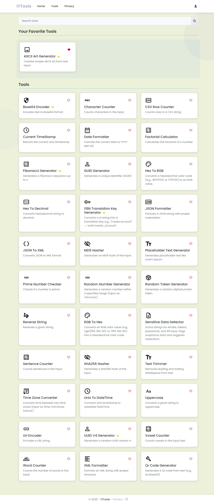

# ITTools User Guide

## Using the Tool as a Guest
- Visit the tools page.
- On the homepage, click **Tools** to access the tools page.

## Using Free Tools
- As a guest, you can only use free tools and cannot save them.
- Access free tools:
  - Enter content and click **Execute** to get results.

## Logging In
- To use the favorite tools feature, users must register and log in.
- Users can also log in with a Google account.

## Saving Favorite Tools
- After logging in, users can save favorite tools by clicking the heart button on the tool.
- Users with at least one favorite tool will have a “Your Favorite Tools” section.
- Users can manage favorite tools on their profile page.

## Upgrading Account
- To use Premium tools, users must have a Premium account.
- On the profile page, click **Upgrade to Premium** to access the upgrade page.

## Account Upgrade Page:
- The page will display a sentence. Users must accurately enter the displayed sentence and click **Submit**. If it matches, the system will upgrade the account.

After upgrading, you can access all tools, including Premium ones.